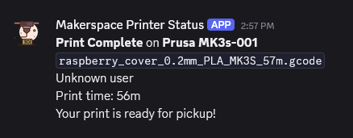

# 3D Printer Discord Bot

A Discord bot that monitors Prusa and Bambu Lab 3D printers in real time, built for makerspaces and shared workshops. Members can check printer availability from Discord before making a trip to the printers.




## Features

- **Live status updates** — A single auto-updating embed shows every printer's state (available, printing, error, offline) with progress and time remaining
- **Print notifications** — Alerts posted when a print completes or fails, with total print duration
- **User mentions** — Tag your Discord username in the filename (`_@username`) and the bot will @ you when your print finishes
- **Prusa + Bambu Lab support** — Monitors Prusa printers via PrusaLink (HTTP) and Bambu Lab printers via MQTT, all from one bot
- **Easy printer management** — Add or remove printers by editing `printers.json` — no code changes needed
- **Configurable** — Custom status title, refresh interval, and per-printer auth settings

## How It Works

The bot polls Prusa printers over HTTP using the PrusaLink API and connects to Bambu Lab printers via MQTT using the `bambulabs_api` library. Printer states are normalized into a common format so both brands appear consistently in Discord. The bot tracks state transitions between polls to detect when a print completes or fails, then sends a notification to a separate channel.

### Discord Channels

The bot uses two channels:

- **#3d-printer-status** — A single embed message that updates in place every polling cycle
- **#3d-printer-notifications** — Individual messages for print completions and failures

### Username Mentions

To get mentioned when your print finishes, append `_@yourdiscordusername` to your filename before the extension:

```
benchy_@josh.gcode
bracket_v3_@bob.smith.bgcode
```

The bot parses the username, looks up the Discord member, and @mentions them in the notification.

## Setup

### Prerequisites

- Python 3.10+
- A Discord bot token ([create one here](https://discord.com/developers/applications))
- Network access to your printers (same LAN or VLAN)
- For Prusa: PrusaLink enabled on the printer (built-in on Mini/Mini+, requires Raspberry Pi on MK3S)
- For Bambu Lab: printer serial number and LAN access code

### Installation

1. Clone the repo:
   ```bash
   git clone https://github.com/yourusername/3d-printer-discord-bot.git
   cd 3d-printer-discord-bot
   ```

2. Install dependencies:
   ```bash
   pip install -r requirements.txt
   ```

3. Create your `.env` file from the template:
   ```bash
   cp .env.example .env
   ```
   Then fill in your Discord bot token and channel IDs.

4. Create your `printers.json` from the template:
   ```bash
   cp printers.json.example printers.json
   ```
   Then add your printers (see [Configuration](#configuration) below).

5. Run the bot:
   ```bash
   python 3dprinter_discord_bot.py
   ```

### Discord Bot Permissions

The bot requires these intents and permissions:

- **Intents:** Message Content, Server Members (for username lookup)
- **Permissions:** Send Messages, Manage Messages (to purge the status channel on startup), Embed Links

## Configuration

### .env

```
DISCORD_TOKEN=your_discord_bot_token_here
STATUS_CHANNEL_ID=your_channel_id_here
NOTIFICATION_CHANNEL_ID=your_channel_id_here
```

### printers.json

```json
{
    "status_title": "3D Printer Status",
    "refresh_interval_seconds": 30,
    "printers": [
        {
            "name": "Bambu A1",
            "type": "bambu",
            "ip": "192.168.1.100",
            "serial": "your_serial_number",
            "access_code": "your_access_code"
        },
        {
            "name": "Prusa Mini",
            "type": "prusa",
            "ip": "192.168.1.101",
            "api_key": "your_api_key"
        },
        {
            "name": "Prusa MK3S",
            "type": "prusa",
            "ip": "192.168.1.102",
            "auth_type": "digest",
            "username": "your_prusalink_username",
            "password": "your_prusalink_password"
        }
    ]
}
```

| Field | Required | Description |
|---|---|---|
| `name` | Yes | Display name shown in Discord |
| `type` | Yes | `"prusa"` or `"bambu"` |
| `ip` | Yes | Printer's IP address |
| `api_key` | Prusa (api_key auth) | PrusaLink API key |
| `auth_type` | Prusa (MK3S) | Set to `"digest"` for MK3S with Raspberry Pi |
| `username` | Prusa (digest auth) | PrusaLink username (default: `"maker"`) |
| `password` | Prusa (digest auth) | PrusaLink password |
| `serial` | Bambu | Printer serial number |
| `access_code` | Bambu | LAN access code |

## Files

| File | Description |
|---|---|
| `3dprinter_discord_bot.py` | Main bot script |
| `printers.json` | Printer configuration (not tracked by Git) |
| `printers.json.example` | Template for printers.json |
| `.env` | Secrets — Discord token and channel IDs (not tracked by Git) |
| `.env.example` | Template for .env |
| `requirements.txt` | Python dependencies |

## Running as a Service

To keep the bot running on a server, create a systemd service:

```ini
[Unit]
Description=3D Printer Discord Bot
After=network-online.target
Wants=network-online.target

[Service]
Type=simple
User=your_user
WorkingDirectory=/path/to/bot
ExecStart=/path/to/venv/bin/python 3dprinter_discord_bot.py
Restart=always
RestartSec=10

[Install]
WantedBy=multi-user.target
```

## Documentation

See the [Wiki](../../wiki) for detailed setup instructions, networking guides, and troubleshooting.

## License

MIT
